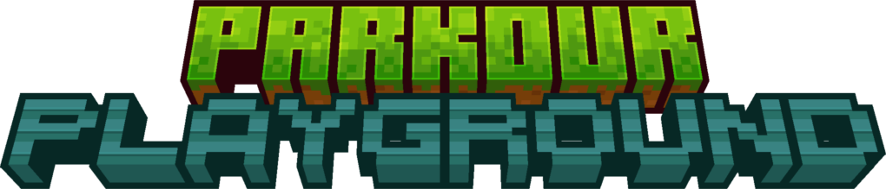

A small minecraft server plugin for a continuous stream of parkour challenges.

*[Video demo](https://youtu.be/iw1VZ1sbv9E)*

### Setup
The process of setting up is pretty long, so you can find the steps in [SETUP.md](docs/SETUP.md)

### Game
The game works in multiple stages
- Intermission
- Pregame
- Game on
- Game end

During **intermission**, a 30-second countdown is running to let players join the round. Players are put into a hub world set in the config.

Once the intermission countdown finishes, the **pregame** stage begins. Players are teleported to the game world at the starting line. A 10-second countdown starts signaling the game is about to begin. Once the countdown ends, a region specified in the config is set to air allowing players to start.

Once the pregame countdown ends, the **game on** state begins. During this state, obstacles will infinitely spawn until a winner is determined. The obstacles will slowly crumble away, with the speed increasing as the game goes on. If an obstacle crumbles while you're on it, then you're eliminated.

Obstacles can be 1 of 4 types, with each giving a unique playstyle
- Normal 
- Elytra
- Trident
- Wind Charge

Once all but 1 player have been eliminated, the game transitions to the **game end** state where a leaderboard of the top 3 scorers is displayed. After a few seconds, it cleans up everything from the game and returns to the intermission state.

### Contributing
If you want to contribute to the project, simply make your code change and open a pull request. Doubt anyone will want to, but it's important nonetheless.