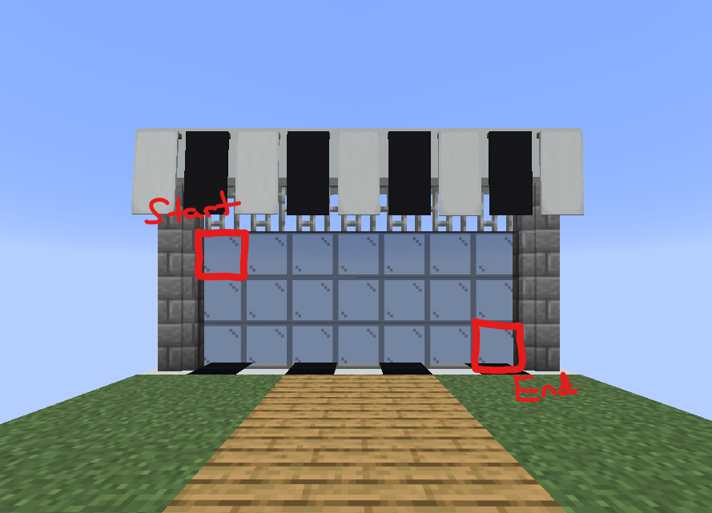

# Parkour Playground Setup

> [!WARNING]\
> In order to use many of the commands in this guide, you will need the `playground.dev` permission. Although it is usually for developers, it contains a list of handy tools for setting up the server.

Here you will find a guide of how to set up every aspect of the plugin.

A very important distinction to make is that this is a **plugin** not a **mod**, meaning you need a server to run it on. Putting the jar into your minecraft client would likely cause issues, **so don't!**

The plugin is made for paper version 1.21.11, but there's a chance it'll work fine on future versions. If you want to run it smoothly though, 1.21.11 is the best version to use.

This plugin depends on Fast Async World Edit, specifically version 2.15.0 which can be found [here](https://github.com/IntellectualSites/FastAsyncWorldEdit/releases/tag/2.15.0)

## Worlds
There are 2 main worlds that need to be created
- The hub world
- The game template world

The hub is a persistent world that is loaded whenever the server is, not one cloned from a template.

Whenever the game starts, the template world is cloned from a copy stored in the folder dictated by the config (default `/templates/worlds`)

To create either of these, start by creating a void world using the `/world create void [name] (--teleport|-t)` command. This will create a world that does not have any terrain.

To fully set up the hub, create the world with a specific name and put that name into the config. After that, set a spawn point. Once the hub world is in the config file, it'll always load and put players into it.

For the game world, you need to set a few more fields in the config
- Player spawn position
- Obstacle pivot start position
- Gate start and end positions

The player spawn is where the players are dropped into the world in the pregame stage.

The obstacle pivot start position is the position where the middle of an obstacle's diamond line (see below) will be positioned to.

The gate start and end are 2 positions that should block the player from starting the course. This should separate the player from the obstacle pivot start to prevent them from starting the game early.

To save the world to a template, you can run `/world template save [world_name] (template_name)` which copies the world `world_name` to the worlds template folder with the name `template_name` (or whatever the `world_name` is if it were not provided).

## Obstacles
All obstacles must have a continuous uninterrupted chain of 5 diamond blocks (signifying the start) and 5 redstone blocks (signifying the end) in order to be exported and loaded.

To enforce this check, instead of using WorldEdit export commands, use the `/obstacle save` command built into the plugin. This requires the player to have the entire obstacle saved to their clipboard (`//copy`) and that it passes the check as mentioned before. Once the command is run, the schematic file will be saved in the templates directory as dictated by the config (default `/templates/obstacles/[TYPE]/[NAME].schem`)

There are 4 obstacle types, make sure you have the specific setup when testing your obstacle:
- Normal - You don't get any items
- Trident - You're given a trident with Riptide 1
- Elytra - You're given an unbreakable elytra
- Wind Charge - You're given an infinite supply of wind charges

**If there is not at least one obstacle of each type, the plugin will error when trying to play**

Do keep in mind that obstacles do not rotate, so it's best to build them in your starting world so they're pointed the right way. The redstone and diamond blocks should also be facing the same direction as the starting point.

If you have any questions feel free to open an issue or contact me on the [hackclub slack](https://hackclub.enterprise.slack.com/team/U07A10XBMGQ) (since that's where most people are coming from)